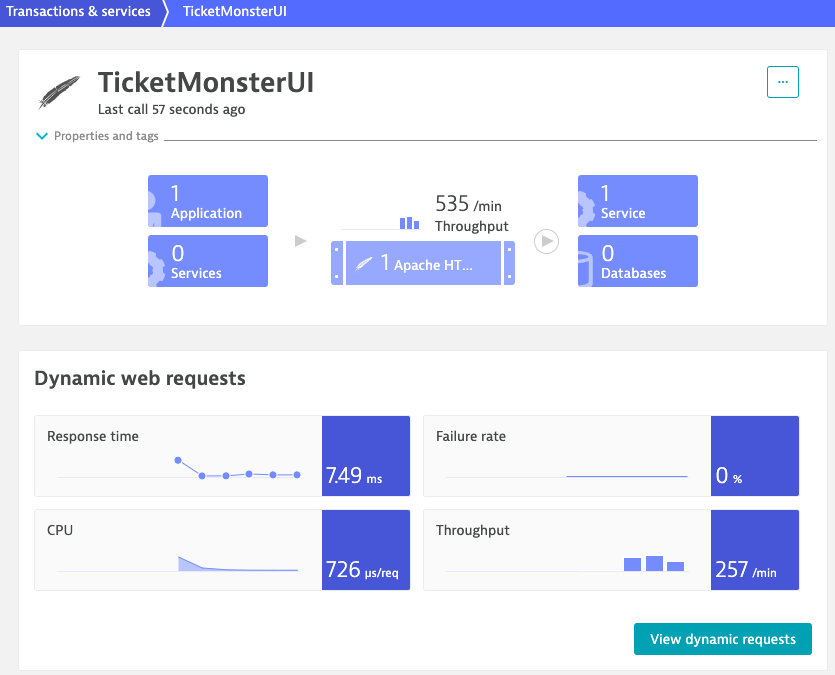

# Generate Load on the New UI

This lab runs a load generation script for TicketMonster. The script simulates real user actions by utilizing the [PhantomJS](http://phantomjs.org/download.html) and [CasperJS](http://casperjs.org/) framework. While PhantomJS is a headless web browser scriptable with JavaScript, CasperJS allows you to build full navigation scenarios.


## Step 1. Run container and start script
1. Usage of load generation script:
    ```
    usage: loadgeneration.sh <target URL> <duration in minutes> <[clients/minute] | [empty = random number of clients (1..10) / minute] >
    ```

1. Get the public endpoint of the user interface **ticketmonster-ui**.
    ```
    kubectl -n ticketmonster get service/ticketmonster-ui
    NAME               TYPE           CLUSTER-IP     EXTERNAL-IP       PORT(S)        AGE
    ticketmonster-ui   LoadBalancer   10.90.11.110   xxx.xxx.xxx.xxx   80:31621/TCP   63s
    ```

1. Start script using the container.
    ```
    (bastion) $ docker run -d dynatraceacm/ticketmonster-load-generator /bin/bash loadgeneration.sh http://xxx.xxx.xxx.xxx 60 15
    ```

1. Verify the container is running

    ```
    (bastion) $docker ps  
    CONTAINER ID        IMAGE                                       COMMAND                  CREATED             STATUS              PORTS               NAMES
    217f216fcab9        dynatraceacm/ticketmonster-load-generator   "/bin/bash loadgener…"   31 seconds ago      Up 30 seconds                           intelligent_hopper
    ```

1. View the load increase in Dynatrace

    
---

[Previous Step: Extract UI From Monolith](../3_Extract_UI_From_Monolith) :arrow_backward: :arrow_forward: [Next Step: Identify a Microservice](../5_Identify_a_Microservice)

:arrow_up_small: [Back to overview](../)
