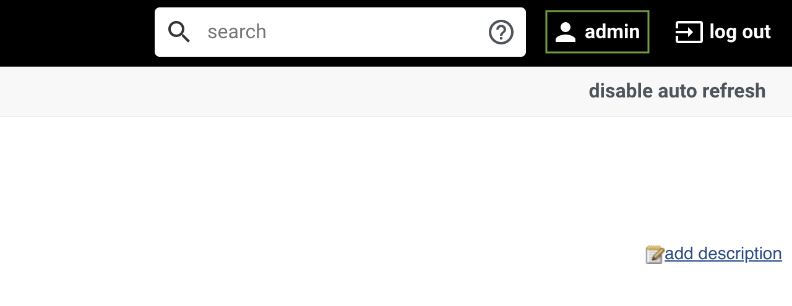
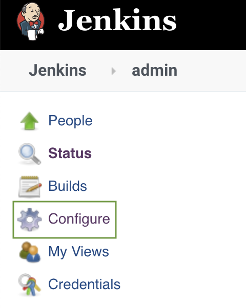

# Deploy Ansible Tower

In this lab we are going to deploy Ansible Tower, our chosen tool for automation, inside our cluster. Therefore, you will find a couple of files prepared in your home directory.

## Data needed

* Access to the bastion host
* Access to Jenkins

## Configure Jenkins credentials

1. Starting with Jenkins 2.129+, the authentication mechanism for the Jenkins API now uses API tokens which allows a tool, in this case ansible tower, to impersonate a user without providing the actual password.

1. Click on your username (**admin**) on the top right of the screen:


1. Click on **Configure** on the left side of the screen to access the user profile:


1. Create a Jenkins API token for your user by clicking on **Add new token**, the name and API token will both be autogenerated after you click on **Generate**:


1. Copy the generated token and save it on your preferred notepad.

1. In the bastion host, run the following script to provide the newly generated token to the ansible tower installer via the creds.json file:

```bash
    (bastion)$ cd
    (bastion)$ ./updateJenkinsPassword.sh
```

## Auto install or manual
In order to have this step go faster, an automatic installation option has been provided. This will take the information that was provided earlier and stored in the creds.json file and use that to install and configure Ansible Tower. For a more verbose experience, a manual installation option is also available.

* [Auto Installation](#auto-installation)
* [Manual Installation](./manual-installation.md)

## Auto Installation

1. To install Ansible Tower automatically, it suffices to execute the following on the bastion host

    ```bash
    (bastion)$ cd
    (bastion)$ ./installAnsible.sh
    ```

1. This script will not only create the necessary K8s resources, but it will also automatically import a self-service license and set up the configuration for Ansible Tower to trigger runbooks as outlined in the [Next Step: Setup Tower](../02_Setup_Tower)

1. The script will output the ansible tower URL that can be then accessed on your browser:

    ```bash
    Ansible has been configured successfully! Copy the following URL to set it as an Ansible Job URL in the Dynatrace notification settings:
    https://XX.XX.XX.XXX/#/templates/job_template/XX

    Ansible Tower login URL: https://XX.XX.XX.XXX/
    ```

1. Login to ansible tower with the following credentials:

    * username: `admin`
    * password: `dynatrace`

1. You should see the default Dashboard of Ansible Tower:


---

:arrow_forward: [Next Step: Setup Dynatrace](../03_Setup_Dynatrace)

:arrow_up_small: [Back to overview](../)
