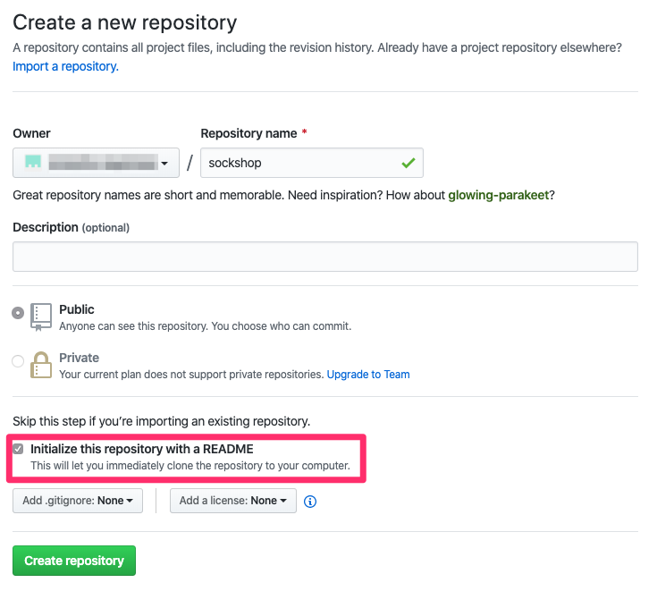

# Preparation for keptn

Before we can install keptn and deploy an application with it, there are a couple of steps we have to take

<!-- ## Step 1: Create a new organization for the carts service
We will be deploying carts as part of the workshop. However, this is a slightly different version of the original carts application so it is best to create a dedicated `Github organization` for it in github. The name is not important. Make sure to keep note of it. More information can be found [here](../../04_Building_Environment_zero/1_Gathering_Facts/github_org.md) -->

## Step 1: Create a new repository in your org for keptn

We will need to create a new repo in your org for the project we will create in keptn. The name should be `sockshop`. Make sure to initialiaze this repo with a README.

## Step 2: Sign up for a ServiceNow developer Account and request a free dev instance

Go to https://developer.servicenow.com/ and register for a new account.
Once your account has been created and you have signed in to the developer portal, click on `Manage` at the top of the screen. Here you can request your free developer instance.

Sign up for a `New York` or `Orlando` release instance on the [ServiceNow Developer Portal](https://developer.servicenow.com/)

---

:arrow_forward: [Next Step: Install Keptn](../01_Install_keptn)

:arrow_up_small: [Back to overview](../)