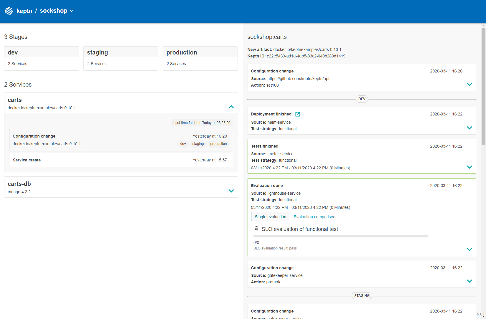
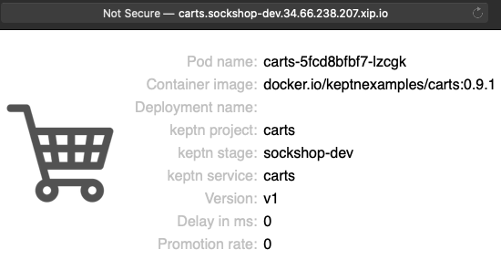
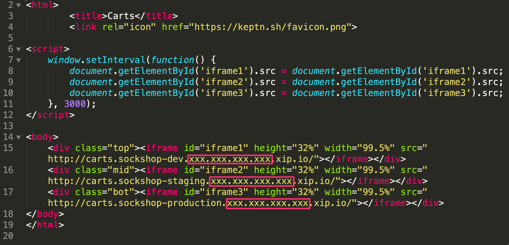

# Onboarding a Service

In this lab you'll onboard a service to keptn

## Step 1: Clone examples repo
Execute the following command from your home directory to clone the keptn examples repo
```
(bastion)$ cd
(bastion)$ git clone --branch 0.5.0 https://github.com/keptn/examples.git --single-branch
(bastion)$ cd examples/onboarding-carts
```

## Step 2: Create a project
The project will be created using the provided `shipyard` file:
```
stages:
- name: "dev"
    deployment_strategy: "direct"
    test_strategy: "functional"
- name: "staging"
    deployment_strategy: "blue_green_service"
    test_strategy: "performance"
- name: "production"
    deployment_strategy: "blue_green_service"
    remediation_strategy: "automated"
```
1. Execute the following commands to set environment variables and creating the project. Replace `YOURKEPTNURL` with the URL of the repo you created for the project *apending the .git*, e.g.: https://github.com/myaclorg/sockshop.git
    ```
    (bastion)$ export GIT_USER=$(cat ../../creds.json | jq -r '.githubUserName')
    (bastion)$ export GIT_TOKEN=$(cat ../../creds.json | jq -r '.githubPersonalAccessToken')
    (bastion)$ export GIT_REMOTE_URL=YOURKEPTNURL
    (bastion)$ keptn create project sockshop --shipyard=./shipyard.yaml --git-user=$GIT_USER --git-token=$GIT_TOKEN --git-remote-url=$GIT_REMOTE_URL
    ```
    
1. Go into your repository on github and verify the results (new branches created, helm charts created).

## Step 3: Onboard services to project
1. Onboard the carts service
    ```
    (bastion)$ keptn onboard service carts --project=sockshop --chart=./carts
    ```
    
1. After onboarding the service, a couple of tests (i.e., functional tests and performance tests) need to be added as basis for quality gates in the different stages:
    * Functional tests
        ```
        (bastion)$ keptn add-resource --project=sockshop --service=carts --stage=dev --resource=jmeter/basiccheck.jmx --resourceUri=jmeter/basiccheck.jmx
        (bastion)$ keptn add-resource --project=sockshop --service=carts --stage=staging --resource=jmeter/basiccheck.jmx --resourceUri=jmeter/basiccheck.jmx
        ```
    * Performance tests
        ```
        (bastion)$ keptn add-resource --project=sockshop --service=carts --stage=dev --resource=jmeter/load.jmx --resourceUri=jmeter/load.jmx
        (bastion)$ keptn add-resource --project=sockshop --service=carts --stage=staging --resource=jmeter/load.jmx --resourceUri=jmeter/load.jmx
        ```
1. Onboard the *carts-db* service using the onboard service command. The `--deployment-strategy` flag specifies that for this service a direct deployment strategy in all stages should be used regardless of the deployment strategy specified in the shipyard. Thus, the database is not blue/green deployed.
    ```
    (bastion)$ keptn onboard service carts-db --project=sockshop --chart=./carts-db --deployment-strategy=direct
    ```
1. During the onboarding of the services, Keptn creates a namespace for each stage based on the pattern: `projectname-stagename`.
    ```
    (bastion)$ kubectl get namespaces
    NAME                  STATUS   AGE
    ...
    sockshop-dev          Active   2m
    sockshop-production   Active   30s
    sockshop-staging      Active   1m
    ```
## Step 4: Send new artifacts and watch Keptn doing the deployment
1. Deploy the carts-db service by executing the keptn send event new-artifact command:
    ```
    (bastion)$ keptn send event new-artifact --project=sockshop --service=carts-db --image=mongo
    ```
1. Deploy the carts service by specifying the built artifact, which is stored on DockerHub and tagged with version 0.9.1.
    ```
    (bastion)$ keptn send event new-artifact --project=sockshop --service=carts --image=docker.io/keptnexamples/carts --tag=0.9.1
    ```
## Step 5: Deploy the keptn's bridge to visualize deployments
```
(bastion)$ cd
(bastion)$ ./installKeptnBridge.sh
```    


## Step 6: View the carts service
Get the URL for your carts service with the following commands in the respective namespaces:
```
(bastion)$ echo http://carts.sockshop-dev.$(kubectl get cm keptn-domain -n keptn -o=jsonpath='{.data.app_domain}')

(bastion)$ echo http://carts.sockshop-staging.$(kubectl get cm keptn-domain -n keptn -o=jsonpath='{.data.app_domain}')

(bastion)$ echo http://carts.sockshop-production.$(kubectl get cm keptn-domain -n keptn -o=jsonpath='{.data.app_domain}')
```
Navigate to the URLs to inspect the carts service. In the production namespace, you should receive an output similar to this:


## Step 7: Prepare the Carts Viewer
Inside this workshop folder you will find a file called `Carts-Viewer.html`.

Download this file to your local machine and open it with your favourite text editor.



On lines `15, 16 and 17`; replace the ip address placeholders (`xxx.xxx.xxx.xxx`) with your keptn endpoint IP and save the file. When you open this file you will be presented with a single view with all namespaces (dev/staging/production) visible.
