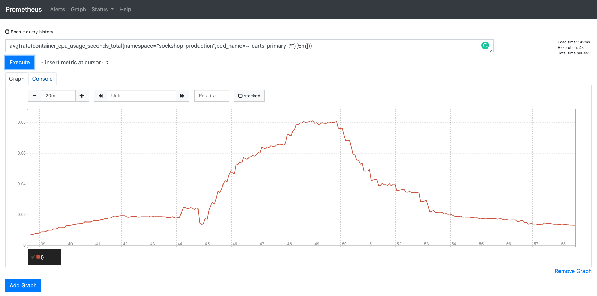
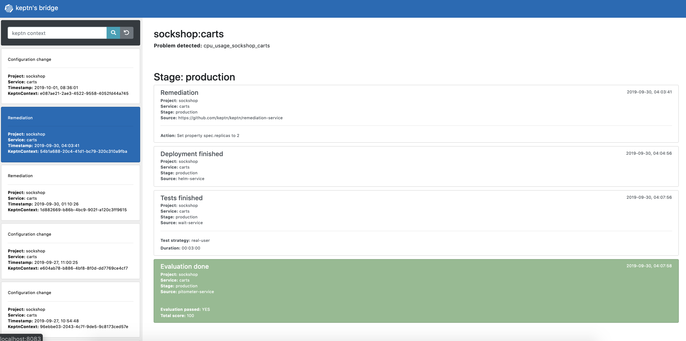

# Self-healing with Keptn and Prometheus

In this tutorial you will learn how to use the capabilities of Keptn to provide self-healing for an application without modifying any of the applications code. The tutorial presented in the following will scale up the pods of an application if the application undergoes heavy CPU saturation.

## Step 1: Configure Prometheus monitoring
Keptn CLI by default uses Prometheus to capture data about deployed services. Like Dynatrace, however, we must first deploy a service to properly orchestrate Prometheus monitoring.

```bash
(bastion)$ kubectl apply -f https://raw.githubusercontent.com/keptn-contrib/prometheus-service/release-0.3.2/deploy/service.yaml
```

In the same `examples` repository, we will find a Prometheus SLI file (`sli-config-prometheus.yaml`), a self-healing SLO file (`slo-self-healing.yaml`), and also a remediation file (`remediation.yaml`), which defines what actions to take when certain SLO thresholds are exceeded.

Apply the configuration:
```bash
(bastion)$ keptn add-resource --project=sockshop --stage=production --service=carts --resource=sli-config-prometheus.yaml --resourceUri=prometheus/sli.yaml
(bastion)$ keptn add-resource --project=sockshop --stage=production --service=carts --resource=slo-self-healing.yaml --resourceUri=slo.yaml
(bastion)$ keptn add-resource --project=sockshop --stage=production --service=carts --resource=remediation.yaml --resourceUri=remediation.yaml
```

Finally, deploy the Prometheus service for the `carts` service.
```bash 
(bastion)$ keptn configure monitoring prometheus --project=sockshop --service=carts
```

## Step 2: Run self-healing

**Before you begin**, make sure that the `carts` service has been successfully deployed to production.

### Generate load for the service
In a new terminal window, execute the following:
```
(bastion)$ cd ~/examples/load-generation/bin
(bastion)$ ./loadgenerator-linux "http://carts.sockshop-production.$(kubectl get cm keptn-domain -n keptn -o=jsonpath='{.data.app_domain}')" cpu
```

### Create a virtual service for Prometheus
In the other terminal window, execute the following to expose Prometheus as a virtual service
```
(bastion)$ cd
(bastion)$ ./exposePrometheus.sh
```
This script will expose Prometheus and output the URL.
Open this URL in a browser

### Verify load in Prometheus
In the graph tab inside Prometheus, add the following expression:

`avg(rate(container_cpu_usage_seconds_total{namespace="sockshop-production",pod_name=~"carts-primary-.*"}[5m]))`

Select the graph tab to see your CPU metrics of the carts-primary pods in the sockshop-production environment. u should see a graph which locks similar to this:

### Watch self-healing in action
After approximately 15 minutes, the Prometheus Alert Manager will send out an alert since the service level objective is not met anymore.

To verify that an alert was fired, select the Alerts view where you should see that the alert `cpu_usage_sockshop_carts` is in the `firing` state:

The alert will be received by the Prometheus service that will translate it into a Keptn CloudEvent. This event will eventually be received by the remediation service that will look for a remediation action specified for this type of problem and, if found, executes it.

In this tutorial, the number of pods will be increased to remediate the issue of the CPU saturation.

Check the executed remediation actions by executing:
```
(bastion)$ kubectl get deployments -n sockshop-production
```
You can see that the `carts-primary` deployment is now served by two pods:
```
NAME             DESIRED   CURRENT   UP-TO-DATE   AVAILABLE   AGE
carts-db         1         1         1            1           37m
carts-primary    2         2         2            2           32m
```
Also you should see an additional pod running when you execute:
```
(bastion)$ kubectl get pods -n sockshop-production
NAME                              READY   STATUS    RESTARTS   AGE
carts-db-57cd95557b-r6cg8         1/1     Running   0          38m
carts-primary-7c96d87df9-75pg7    2/2     Running   0          33m
```
Furthermore, you can use Prometheus to double-check the CPU usage:


Finally, we can consult the Keptn bridge to find the problem event.

```
(bastion)$ echo http://bridge.keptn.$(kubectl get cm keptn-domain -n keptn -o=jsonpath='{.data.app_domain}')
```
In this example, the bridge shows that the remediation service triggered an update of the configuration of the carts service by increasing the number of replicas to 2. When the additional replica was available, the wait-service waited for three minutes for the remediation action to take effect. Afterwards, an evaluation by the pitometer-service was triggered to check if the remediation action resolved the problem. In this case, increasing the number of replicas achieved the desired effect, since the evaluation of the service level objectives has been successful.


---

[Previous Step: Quality Gates](../04_Quality_Gates) :arrow_backward: :arrow_forward: [Next Step: Runbook Automation](../06_Runbook_Automation)

:arrow_up_small: [Back to overview](../)
