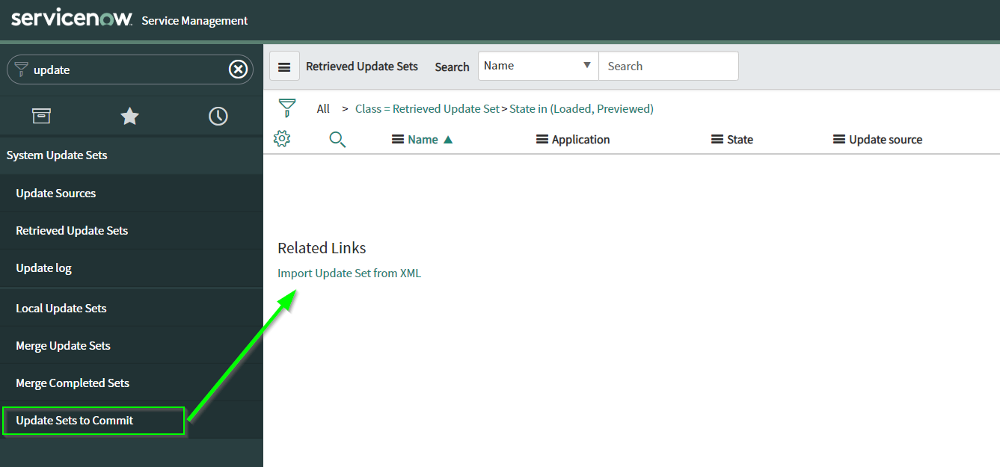
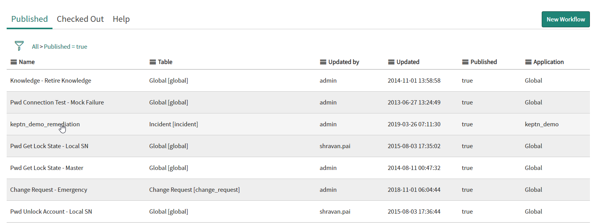
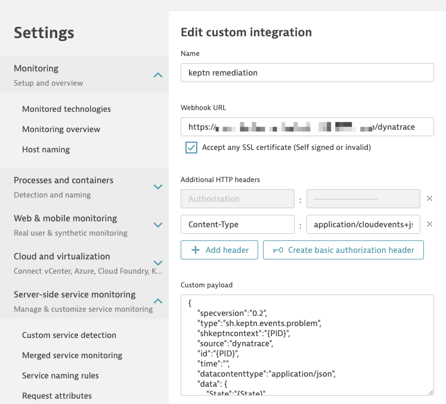
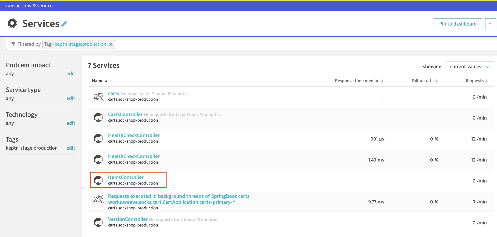
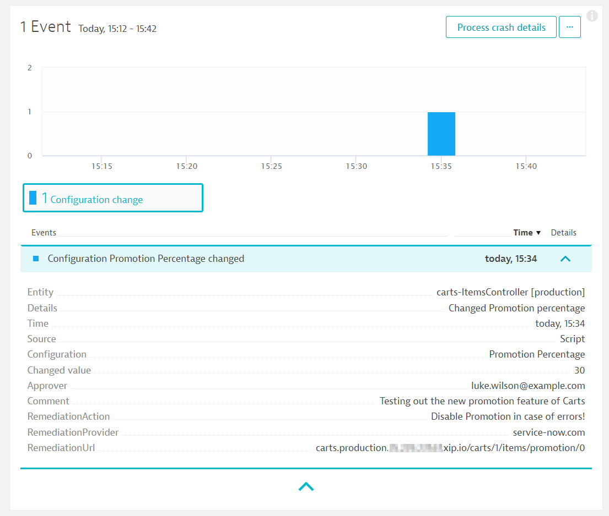
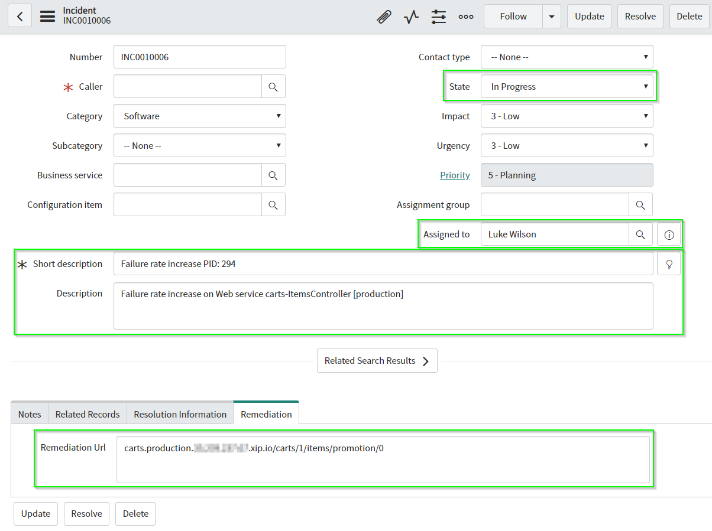
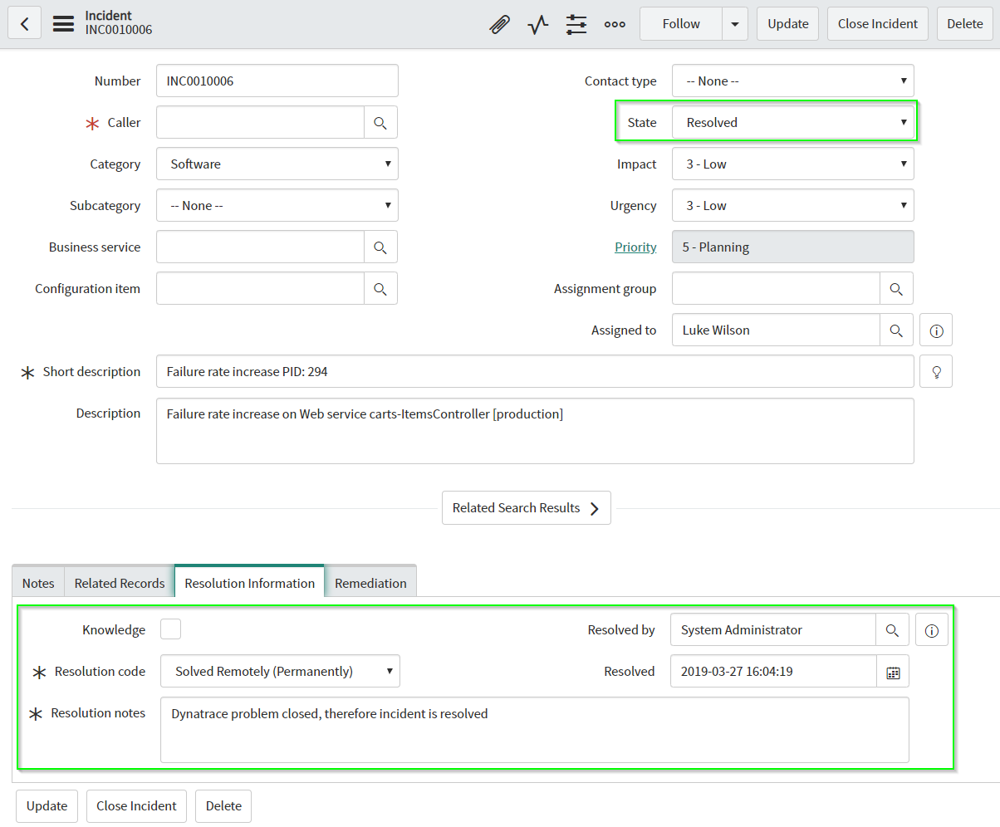

# Runbook Automation with ServiceNow

In this lab you'll see runbook automation in action with ServiceNow and Keptn.

## Step 1: Clone the servicenow-service repo
```
(bastion)$ cd 
(bastion)$ git clone --branch 0.1.4 https://github.com/keptn-contrib/servicenow-service.git --single-branch
(bastion)$ cd servicenow-service
```

## Step 2: Configure Keptn
### Dynatrace Secret
The Dynatrace secret should already have been created while setting up Dynatrace monitoring. Please verify your Dynatrace secret by executing the following commands:
```
(bastion)$ kubectl get secret dynatrace -n keptn -o yaml
apiVersion: v1
data:
  DT_API_TOKEN: xxxxxx
  DT_TENANT: xxxxxx
kind: Secret
metadata:
  creationTimestamp:
  ...
```
The `DT_API_TOKEN` and the `DT_TENANT` need to be stored in an environment variable. Therefore, copy and paste the following command to make sure that `DT_TENANT` stores a url that follows the pattern `{your-domain}/e/{your-environment-id}` for a managed Dynatrace tenant or `{your-environment-id}.live.dynatrace.com` for a SaaS tenant.
```
(bastion)$ export DT_TENANT=$(kubectl get secret dynatrace -n keptn -o=jsonpath='{.data.DT_TENANT}' | base64 --decode)
(bastion)$ export DT_API_TOKEN=$(kubectl get secret dynatrace -n keptn -o=jsonpath='{.data.DT_API_TOKEN}' | base64 --decode)
(bastion)$ echo $DT_TENANT $DT_API_TOKEN
```

### ServiceNow Secret
Create the ServiceNow secret to allow Keptn to create/update incidents in ServiceNow and run workflows. For the command below, use your ServiceNow tenant id (8-digits), your ServiceNow user (e.g., admin) as user, and your ServiceNow password as token:
```
(bastion)$ kubectl -n keptn create secret generic servicenow --from-literal="tenant=xxx" --from-literal="user=xxx" --from-literal="token=xxx"
```

Note: If your ServiceNow password has some special characters in it, you need to [escape](https://kubernetes.io/docs/concepts/configuration/secret/) them.

## Step 3: Setup the workflow in ServiceNow
A ServiceNow Update Set is provided to run this tutorial. To install the Update Set follow these steps:
1. Login to your ServiceNow instance.
1. Look for update set in the left search box and navigate to `Update Sets to Commit` 
1. Download the [update set](https://raw.githubusercontent.com/keptn-contrib/servicenow-service/release-0.1.4/usecase/keptn_demo_remediation_updateset.xml) to your machine
1. Click on `Import Update Set from XML` and upload the downloaded `xml` file
1. In the right upper corner, click on `Preview Update Set` and once previewed, click on `Commit Update Set` to apply it to your instance 
1. After importing, enter `keptn` as the search term into the upper left search box. 
1. Click on New and enter your Dynatrace API token as well as your Dynatrace tenant, excluding the leading `https://` and trailing `/`.
1. You can also take a look at the predefined workflow that is able to handle Dynatrace problem notifications and remediate issues. 
    * Navigate to the workflow editor by typing `Workflow Editor` and clicking on the item `Workflow > Workflow Editor`
    * The workflow editor is opened in a new window/tab
    * Look for the workflow `keptn_demo_remediation` (it might as well be on the second or third page) 
    * Open the workflow by clicking on it. It will look similar to the following image. By clicking on the workflow notes you can further investigate each step of the workflow. 

## Step 4: Verify Dynatrace problem notification
During the setup of Dynatrace a problem notification has already been set up for you. You can verify the correct setup by following the instructions:

1. Login to your Dynatrace tenant.
1. Navigate to `Settings > Integration > Problem notifications`
1. Click on `Set up notifications` and select `Custom integration`
1. Click on `Keptn remediation`
1. The problem notification should look similar to the one in this screen shot: 


## Step 5: Adjust anomaly detection in Dynatrace
The Dynatrace platform is built on top of AI, which is great for production use cases, but for this demo we have to override some default settings in order for Dynatrace to trigger the problem.

Before you adjust this setting, make sure to have some traffic on the service in order for Dynatrace to detect and list the service. The easiest way to generate traffic is to use the provided file `add-to-carts.sh` in the `./usecase folder`. This script will add items to the shopping cart and can be stopped after a couple of added items by hitting `CTRL+C`.

*It is suggested to open a new terminal window for the load generation.*

Navigate to the servicenow-service/usecase folder and start the load generation:
```
(bastion)$ cd ~/servicenow-service/usecase
(bastion)$ ./add-to-cart.sh "carts.sockshop-production.$(kubectl get cm keptn-domain -n keptn -o=jsonpath='{.data.app_domain}')"
```
You should see some logging output each time an item is added to your shopping cart:

```
...
Adding item to cart...
{"id":"3395a43e-2d88-40de-b95f-e00e1502085b","itemId":"03fef6ac-1896-4ce8-bd69-b798f85c6e0b","quantity":73,"unitPrice":0.0}
Adding item to cart...
{"id":"3395a43e-2d88-40de-b95f-e00e1502085b","itemId":"03fef6ac-1896-4ce8-bd69-b798f85c6e0b","quantity":74,"unitPrice":0.0}
Adding item to cart...
{"id":"3395a43e-2d88-40de-b95f-e00e1502085b","itemId":"03fef6ac-1896-4ce8-bd69-b798f85c6e0b","quantity":75,"unitPrice":0.0}
...
```


Once you generated some load, navigate to `Transaction & services` and find the service `ItemsController` in the `sockshop-production` environment.

Open the service and click on the three dots button to `Edit` the service.

In the section `Anomaly detection` override the global anomaly detection and set the value for the `failure rate` to use `fixed thresholds` and to alert if `10%` custom failure rate are exceeded. Finally, set the `Sensitiviy` to `High`.


## Step 6: Run the usecase
### Configuration change at runtime
1. In another terminal window than the load generation (do not stop the load generation), execute the following:

    ```
    (bastion)$ cd ~/servicenow-service/usecase
    (bastion)$ export DT_TENANT=$(kubectl get secret dynatrace -n keptn -o=jsonpath='{.data.DT_TENANT}' | base64 --decode)
    (bastion)$ export DT_API_TOKEN=$(kubectl get secret dynatrace -n keptn -o=jsonpath='{.data.DT_API_TOKEN}' | base64 --decode)
    (bastion)$ echo $DT_TENANT $DT_API_TOKEN
    (bastion)$ ./enable-promotion.sh "carts.sockshop-production.$(kubectl get cm keptn-domain -n keptn -o=jsonpath='{.data.app_domain}')" 30
    ```
    Note: The parameter `30` at the end, which is the value for the configuration change and can be interpreted as for 30 % of the shopping cart interactions a special item is added to the shopping cart. This value can be set from `0` to `100`. For this use case the value `30` is just fine.
1. You will notice that your load generation script output will include some error messages after applying the script:
    ```
    ...
    Adding item to cart...
    {"id":"3395a43e-2d88-40de-b95f-e00e1502085b","itemId":"03fef6ac-1896-4ce8-bd69-b798f85c6e0b","quantity":80,"unitPrice":0.0}
    Adding item to cart...
    {"timestamp":1553686899190,"status":500,"error":"Internal Server Error","exception":"java.lang.Exception","message":"promotion campaign not yet implemented","path":"/carts/1/items"}
    Adding item to cart...
    {"id":"3395a43e-2d88-40de-b95f-e00e1502085b","itemId":"03fef6ac-1896-4ce8-bd69-b798f85c6e0b","quantity":81,"unitPrice":0.0}
    ...
    ```
### Problem detection by Dynatrace
Navigate to the ItemsController service by clicking on `Transactions & services` and look for your ItemsController. Since our service is running in three different environment (dev, staging, and production) it is recommended to filter by the `environment:sockshop-production` to make sure to find the correct service. *Pro Tip: Create a management zone for this!*

When clicking on the service, in the right bottom corner you can validate in Dynatrace that the configuration change has been applied.

After a couple of minutes, Dynatrace will open a problem ticket based on the increase of the failure rate.


### Incident creation & workflow execution by ServiceNow
The Dynatrace problem ticket notification is sent out to Keptn which puts it into the problem channel where the ServiceNow service is subscribed. Thus, the ServiceNow service takes the event and creates a new incident in ServiceNow. In your ServiceNow instance, you can take a look at all incidents by typing in `incidents` in the top-left search box and click on `Service Desk > Incidents`. You should be able to see the newly created incident, click on it to view some details.

After creation of the incident, a workflow is triggered in ServiceNow that has been setup during the import of the Update Set earlier. The workflow takes a look at the incident, resolves the URL that is stored in the Remediation tab in the incident detail screen. Along with that, a new custom configuration change is sent to Dynatrace. Besides, the ServiceNow service running in Keptn sends comments to the Dynatrace problem to be able to keep track of executed steps.

You can check both the new custom configuration change on the service overview page in Dynatrace as well as the added comment on the problem ticket in Dynatrace.

Once the problem is resolved, Dynatrace sends out another notification which again is handled by the ServiceNow service. Now the incidents gets resolved and another comment is sent to Dynatrace. The image shows the updated incident in ServiceNow. The comment can be found if you navigate to the closed problem ticket in Dynatrace.


---

[Previous Step: Self Healing](../05_Self-Healing) :arrow_backward:

:arrow_up_small: [Back to overview](../)
